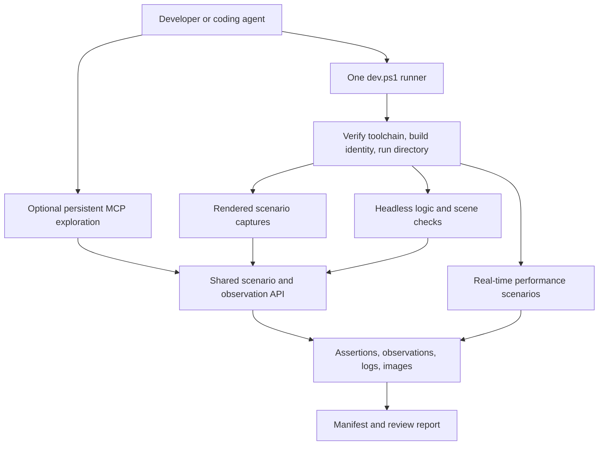

# PAIN TAXI harness review — 20 September 2026

The best next setup is one small, reliable runner with a shared scenario contract, separate logic/visual/performance modes, and an optional persistent MCP session for exploration. Keep the useful capture and smoke-test code. Fix the meaning of success and make scenarios reproducible before adding more capabilities.

This records the initial design review, before the user authorized implementation. That review inspected the dirty checkout, existing captures, installed MCP package source, CI configuration, and primary documentation without launching a game, editor, build, or live MCP session. A small PowerShell expression probe reproduced one argument-handling defect. Git HEAD was `334fdfec98dfc2b5f929af4bfda32e3e496080ea`; that SHA alone does not identify the many uncommitted changes reviewed. The subsequent implementation and current usage are described in [the harness guide](visual_capture_harness.md); its run manifests provide runtime evidence. The findings below refer to the original files.

## What already works as a foundation

- Godot 4.6.3 Mono and .NET 8.0.422 are pinned in the project, SDK configuration, and verification script. The CI workflow also checks the downloaded engine archive's SHA-512.
- `tools/dev.ps1` provides verification, build, headless smoke tests, capture, and launch commands.
- `tests/visual_capture_harness.gd` already supports useful state, camera, vehicle, burst, and asset inspection concepts, plus PNG/JSON output and contact sheets.
- Capture waits for `RenderingServer.frame_post_draw`, which is the appropriate boundary after viewport rendering has completed. Retain that synchronization. [Godot RenderingServer](https://docs.godotengine.org/en/4.6/classes/class_renderingserver.html#class-renderingserver-signal-frame-post-draw)
- CI already separates headless smoke execution from an Xvfb-rendered capture. Performance budgets deliberately distinguish structural counts from timing measurements.

Local references: `project.godot`, `global.json`, `kart_racer.csproj`, `tools/dev.ps1`, `.github/workflows/verify.yml`, `perf/budgets.json`.

## Findings, in priority order

| Priority | Finding and local evidence | Consequence |
| --- | --- | --- |
| P0 | `_run_suite()` warns after a failed state but always calls `_finish(0)` (`tests/visual_capture_harness.gd:115–149`). | An incomplete suite can be green. Count expected, passed, failed, and missing captures; any required failure must fail the run. |
| P0 | Unknown state names fall back to the menu and return true (`:439–442`). Repair can return true without a repair shop (`:351–354`); results can return true without establishing an actual results state (`:397–408`). | The filename describes the requested state, not necessarily the observed state. Invalid requests and missing preconditions must fail explicitly. |
| P0 | The scene is added to the tree and eight frames elapse before `TrackBuilder.Seed` is set (`:157–168`). `TrackBuilder._Ready()` seeds and generates the city immediately (`TrackBuilder.cs:123–159`). | `-Seed` does not control that city's initial generation. Configure the instantiated scene before `add_child`, and explicitly seed the separate Endless Road and other RNG streams. |
| P1 | The two PowerShell launchers implement different validation. `visual_harness.ps1:225–235` colors errors but only rejects a nonzero process exit. `dev.ps1:94–126` optionally checks selected diagnostics, but its smoke-test calls omit that option. Neither launcher has its own process timeout. | Script errors, interrupted coroutines, and hangs are handled inconsistently. One shared supervisor should own timeouts, diagnostics, exit status, and required result records. |
| P1 | Suite output paths ignore `_output` and always use `DEFAULT_OUTPUT_DIR` (`visual_capture_harness.gd:135,145`). Default filenames are reused. `dev.ps1:191–192` applies file-style deletion to the suite directory, which is unsafe for unattended reruns of a populated directory. | Custom output directories do not mean what callers expect; concurrent or partial runs can leave mixed artifacts. Allocate a new run directory instead of deleting prior results. |
| P1 | Neither capture command builds C# first (`tools/dev.ps1:180–214`, `tools/visual_harness.ps1`). | Captures can represent an older compiled assembly after C# edits. CI's separate build helps CI, but local capture needs a build-freshness contract. |
| P1 | Staging uses many elapsed-time waits; teardown frees the main scene but leaves autoloads alive (`visual_capture_harness.gd:723–734`). The shell loads local settings and bindings in `_Ready()` (`ui/RetroNeonCabShell.cs:191–206`). | Results depend on frame timing, persistent state, suite order, and the developer's profile. Use bounded state predicates, explicit configuration, and process isolation for authoritative runs. |
| P1 | Telemetry looks for `ScoreLabel` and `TimerLabel` (`visual_capture_harness.gd:662–666`), silently substituting empty strings. All 11 top-level JSON capture files inspected had both fields empty. The metadata does not bind output to source or assembly identity. | JSON existence is weak evidence. Required observations need typed fields, validity status, and run/source/build identity. Record the actual runtime renderer rather than only its project setting. |
| P2 | Standalone scene inspection creates a fixed camera and does not apply the advertised camera overrides (`visual_capture_harness.gd:513–587`). Custom position/target uses `Vector3.ZERO` as an absence sentinel (`:456–461`). | `-Scene ... -CameraPreset orbit` does not apply the requested preset; targeting the origin cannot be expressed reliably. Track argument presence separately from its value. |
| P2 | `-Crt` and `-Scanlines` use `.Value` on nullable Boolean parameters (`visual_harness.ps1:185,188`). | A minimal PowerShell probe using the same parameter type and strict mode throws “The property 'Value' cannot be found”. Convert the non-null Boolean directly. The whole harness was not executed for this finding. |

The new harness script, its PowerShell wrapper, and its documentation are currently untracked; tracked files in the dirty checkout refer to them. Include them together when preparing the eventual change for review. This is a packaging observation about this checkout, not a claim about a completed CI run.

The existing August 27 core contact sheet was inspected as historical output. Its settings tile is almost empty and its drop-off tile is largely occluded. That does not establish a current game defect, but it illustrates why a successful PNG write is insufficient to prove a valid scenario. September 20 capture metadata likewise has no source fingerprint, so it cannot establish which dirty revision produced the image.

## Proposed setup

### 1. One supervisor, with a small scenario registry

Keep `tools/dev.ps1` as the public command. Make `visual_harness.ps1` a compatibility wrapper. Centralize executable discovery, argument validation, build/import readiness, timeout, logs, process cleanup, and artifact validation in one implementation.

Start with a few declarative scenarios and small reusable handlers. Each scenario declares its seed, viewport, settings profile, setup mode, actions, readiness predicates, timeout, capture points, and assertions. Do not build a general workflow language.

Use two clearly labeled setup modes:

- **Fixture capture:** explicitly arrange a passenger, camera, or vehicle for repeatable visual inspection. Teleporting and controlled state injection are acceptable here.
- **Player journey:** enter through real buttons or input events and verify transitions, such as menu → run → pickup → delivery. This proves a different claim and must not silently inherit fixture shortcuts.

Godot's `Input.action_press()` changes action state but does not invoke `_input()`. Event-driven UI tests need suitable input events or a scene runner; directly invoking `StartRun()` does not verify that the start button works. [Godot Input](https://docs.godotengine.org/en/4.6/classes/class_input.html#class-input-method-action-press)

A pickup scenario should assert the requested passenger/loading state before capture. A drift scenario should capture while drift is active; the current script releases drift and steering before its screenshot. Predicate waits should record the final observed value on timeout.

### 2. Reproducible visual capture, with honest limits

Set seeds before generation and reset all relevant RNG sources. Pin engine, renderer, physics settings, resolution, and profile. Use physics-tick-indexed actions and bounded state predicates instead of arbitrary delays. Give fixture screenshots a controlled clock for animations/shaders that depend on time.

Godot documents repeatable RNG sequences for a given seed, while treating the underlying algorithm as an implementation detail. This supports pinning the engine and recording seeds; it does not establish cross-machine determinism of the whole game. [Godot RandomNumberGenerator](https://docs.godotengine.org/en/4.6/classes/class_randomnumbergenerator.html)

For short motion reviews, evaluate `--fixed-fps` and the built-in Movie Maker/PNG sequence support. These support consistent simulation pacing and frame selection. They are offline capture mechanisms, so use a separate real-time mode for frame-time benchmarks. [Godot command line](https://docs.godotengine.org/en/4.6/tutorials/editor/command_line_tutorial.html), [Godot Movie Maker](https://docs.godotengine.org/en/4.6/tutorials/animation/creating_movies.html)

Initially use a fresh process and isolated test profile per authoritative scenario. Optimize into shared-process suites only after explicit reset contracts cover autoload state, settings, input, signals, timers, and audio. Keep a warm session for exploratory camera adjustments where reproducible pass/fail evidence is unnecessary.

### 3. Separate headless execution from background rendering

The current Windows command is a normal renderer with its window moved to `(-9999,-9999)` and audio disabled. It is not actual Godot headless mode. Official documentation states that `--headless` disables rendering and window management. Adding that flag would defeat viewport screenshot capture. [Godot RenderingServer](https://docs.godotengine.org/en/4.6/classes/class_renderingserver.html)

For local Windows captures, retain rendered execution and add explicit no-focus, mouse-passthrough, borderless behavior and controlled input. Validate startup focus behavior on the actual machine before promising no desktop disruption. Godot exposes the window flags; the installed MCP bridge already uses those flags at `dist/scripts/mcp_bridge.gd:46–50`. [Godot DisplayServer](https://docs.godotengine.org/en/4.6/classes/class_displayserver.html#enum-displayserver-windowflags)

For CI, keep the existing Xvfb rendering route, pin the Compatibility renderer, verify output dimensions, and record the actual rendering device/driver. Treat its images as evidence from that environment. Keep performance timing on a known hardware profile with real-time pacing, no screenshot readback during measurement, and no competing benchmark jobs. A Linux capture does not establish Windows GPU performance or pixel identity.

### 4. A useful evidence bundle

Write a new directory for every run, containing a manifest, complete logs, per-scenario observations, PNGs or short frame sequences, and an HTML review page. Include scenario labels on the contact sheet. The review page should show failed assertions beside the image, not only a green process status.

The manifest should include run ID, Git commit, dirty-source fingerprint including relevant untracked files, assembly hash, scenario/config hash, engine/.NET versions, actual renderer/device, viewport, seeds, tick counts, durations, and an explicit evidence kind (`fixture`, `journey`, `visual`, or `performance`). Treat unknown telemetry as unavailable, not zero or an empty success field.

A successful required scenario means: setup validated, assertions passed, expected artifacts were freshly written and readable, required metadata exists, and cleanup completed. Compare images only within compatible environment profiles. Start with semantic assertions and human review; add tolerant regional image comparisons after measuring normal variation. Do not automatically accept a changed baseline.

## Tool choices

| Option | Assessment for this repository |
| --- | --- |
| Harden the existing runner and scenarios | Recommended first. It addresses proven defects without replacing useful game-specific code. |
| GdUnit4Net | Best candidate for a small C# testing pilot. Its first-party docs describe C# assertions, scene input simulation, signal/value waits, a VSTest adapter, and optional Godot runtime execution. Verify a pinned package combination against this exact Godot 4.6.3/.NET 8 setup before migration. The docs are not evidence that this checkout already works with it. [Project](https://github.com/godot-gdunit-labs/gdUnit4Net), [API documentation](https://github.com/godot-gdunit-labs/gdUnit4Net/blob/master/Api/README.md) |
| GUT | A reasonable GDScript choice; its repository describes GDScript tests and lists a Godot 4.6-compatible release. Since the application is predominantly C#, I would not introduce both GUT and GdUnit4Net now. Retain existing GDScript smoke tests while piloting the C# path. [GUT](https://github.com/bitwes/Gut) |
| Godot MCP Runtime | Useful optional interactive layer. Version 3.2.1 is already pinned under `tools/godot-mcp-runtime`; no Godot tools were exposed in this conversation, and no live connection was tested. Its project documents runtime screenshots, input sequences, UI discovery, and live scripts. Use it to explore a problem, then preserve the reproduction in an ordinary scenario runnable without an agent. [Project](https://github.com/Erodenn/godot-mcp-runtime) |

MCP should call the shared scenario/observation surface where practical. It should not become a second source of game-state truth. Rebuild and restart after C# changes; a persistent process is not evidence that new C# code was loaded. If later running agents concurrently, assign each a checkout, run directory, test profile, and port; serialize GPU measurements. Keep the existing GitHub issue/project workflow as the coordination authority.

## Adoption order and acceptance checks

1. **Make results trustworthy:** fix suite exit status, invalid-state handling, output paths, Boolean options, required artifacts, and supervisor timeouts. Demonstrate that a deliberately failed suite member produces a nonzero result; invalid state and unwritable output fail; an old PNG cannot satisfy a new run; custom suite output is honored.
2. **Make scenarios repeatable:** seed before `_Ready`, bind captures to the built assembly, isolate profile/state, and introduce readiness assertions. Repeat a small menu/gameplay/pickup/Endless Road set with identical configuration. Compare semantic observations first, then establish visual tolerance from measured repeats.
3. **Improve agent iteration:** add a compact review report, labeled contact sheets, and an optional warm MCP session. Verify a real launch → input → observation → screenshot → cleanup sequence before calling integration complete.
4. **Grow tests selectively:** pilot one pure C# rule test and one Godot scene test with GdUnit4Net. Keep current smoke checks until replacements prove equivalent coverage. Expand CI visual coverage from its single gameplay capture only after the smaller set is reliable.

The immediate engineering priority is phases 1 and 2. They improve every future visual review, test, and agent session. A broad framework migration or custom agent-orchestration service would add maintenance before solving the defects demonstrated here.
